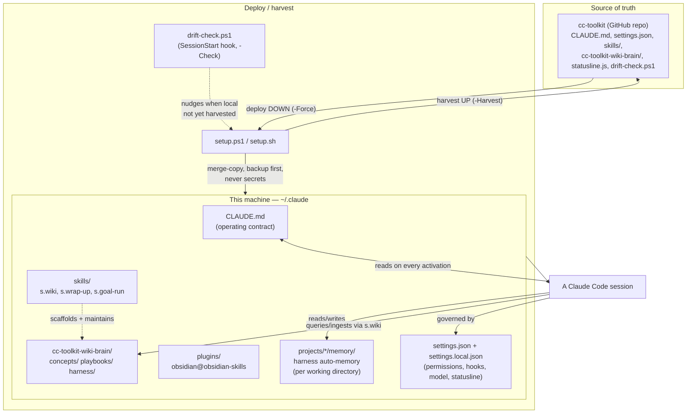

# Harness Overview — the `~/.claude` Meta-Map

**Anchor note for the `harness/` zone.** One picture of how the whole Claude Code setup fits
together, with links out to the pages that go deeper on each part. Start here; follow
`[[wikilinks]]` for detail.

## The map

## The pieces, briefly

- **Source of truth is `cc-toolkit` on GitHub, not this machine.** Every machine deploys
  *from* the repo; local drift is pulled up via `-Harvest`, never the other way round. Full
  mechanics: [[../playbooks/cc-toolkit-deploy-lifecycle]].
- **Memory has two independent systems** that are easy to conflate: the harness's own
  auto-memory (`projects/*/memory/`) versus this toolkit's three-tier project convention
  (`CLAUDE.md` / `STATUS.md` / wiki brain). Full routing rule: [[memory-architecture]].
- **Three global skills** (`s.wiki`, `s.wrap-up`, `s.goal-run`) plus one installed plugin
  bundle (`obsidian@obsidian-skills`) make up the skill surface. What each does and triggers
  on: [[skills-catalog]].
- **This brain itself is `s.wiki`-shaped** — `cc-toolkit-wiki-brain/` is an `s.wiki` vault
  with a dual charter (transferable patterns + this `harness/` zone). Charter and conventions:
  [[../wiki-schema]].
- **`settings.json`** carries the read-only permission allowlist, the `cleanup.ps1` deny rule,
  model/effort defaults, the `SessionStart` drift-check hook, and the statusline command.
  `settings.local.json` stays machine-local (never deployed) and currently adds
  PostToolUse/Stop hooks that log to a dashboard event file.
- **`plugins/`** is runtime state, never versioned directly — `plugins.json` in the repo
  records the declarative intent (marketplaces + plugin names) and deploy re-hydrates it via
  `claude plugin install`. See [[../concepts/declarative-intent-over-materialized-state]] for
  the general pattern this instantiates.

## What's deliberately not here yet

Session lifecycle and the rest of the harness surface — plan mode, the Explore/Plan subagent
split, the one-task-per-session → checkpoint → `/clear` cadence, hook mechanics in depth, and
a closer read of `settings.json`'s permission model — is scoped as a deferred second pass, not
covered by this note or its siblings.

## Related
- [[memory-architecture]]
- [[skills-catalog]]
- [[../playbooks/cc-toolkit-deploy-lifecycle]]
- [[../wiki-schema]]
