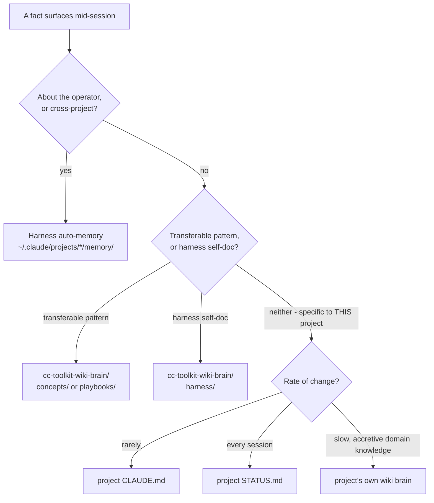

# Memory Architecture

There are **two distinct memory systems** in play, easy to conflate because they share
vocabulary. This note untangles them and gives the routing rule for "where does this fact go."

## The two systems

1. **Harness auto-memory** — built into Claude Code itself, not designed by this toolkit.
   Lives at `~/.claude/projects/<cwd-hash>/memory/`, one folder per working directory the
   harness has seen. Populated automatically across sessions as the assistant learns about
   the operator and the project. Four typed categories: `user` (role, expertise, preferences),
   `feedback` (corrections and confirmed approaches), `project` (goals, decisions, deadlines),
   `reference` (pointers to external systems). Indexed per-project by a `MEMORY.md`.

2. **The three-tier project convention** — a design this toolkit imposes *on top of* the
   harness, documented in the global `CLAUDE.md`'s `## Memory architecture` section and
   scaffolded by the `s.wiki` skill (see [[skills-catalog]]). Three tiers, split by
   **rate-of-change**, not topic:

   | Tier | File | Holds | Changes |
   |---|---|---|---|
   | Contract | `CLAUDE.md` | stable rules, architecture, thin pointers | rarely |
   | Working memory | `STATUS.md` | current version, active task, next step | every session |
   | Long-term | wiki brain (project's own, via `s.wiki`) | domain knowledge, decisions, changelog | slowly, accretive |

## Routing table — where does a fact go?

| Fact type | Destination | Why |
|---|---|---|
| Operator preferences, working style, cross-project facts about the user | Harness auto-memory (`~/.claude/projects/*/memory/`) | Persists across every project automatically; not something a project's own docs should carry |
| A pattern/lesson transferable across clients or projects | Global `cc-toolkit-wiki-brain/concepts/` or `playbooks/` | The compounding well — rides to every machine |
| Self-documentation of the Claude Code harness/toolkit itself | Global `cc-toolkit-wiki-brain/harness/` | New zone (this note lives here); not a client pattern, not operator trivia — see [[../wiki-schema]] dual charter |
| Stable rules/architecture for **one** project | That project's `CLAUDE.md` | Rarely changes; the contract |
| "Where are we right now" for **one** project | That project's `STATUS.md` | Volatile; read first when resuming |
| Domain knowledge specific to **one** project | That project's own wiki brain | Doesn't generalize elsewhere; stays local |

The global `CLAUDE.md`'s own wording for this: *"operator + cross-project facts about me →
harness memory; cross-project knowledge → the global `cc-toolkit-wiki-brain`; per-project
domain knowledge → that project's own wiki brain."* This note is the expanded map of that
one-line rule.

## Flow

## Why the split matters

- **Harness auto-memory is per-machine-and-session-scoped** by the harness itself — it is not
  version-controlled, not deployed by `cc-toolkit`, and not something `s.wiki` touches. It is
  a different persistence layer entirely, governed by the harness's own memory rules (what to
  save, what NOT to save — code patterns, git history, and anything derivable from reading the
  project are explicitly excluded there).
- **The three-tier convention is deployed and version-controlled** (`CLAUDE.md` per project,
  `s.wiki`-scaffolded brains) and is this toolkit's own design, not a harness feature.
- Conflating them causes duplicate or misplaced facts: an operator preference written into a
  project's `CLAUDE.md` won't follow the operator to the next project; a project-specific
  decision written into harness auto-memory won't be visible to a teammate reading that
  project's docs.

## Related
- [[skills-catalog]] — `s.wiki` is the engine that scaffolds and maintains the three-tier
  convention's long-term layer
- [[../wiki-schema]] — this brain's own charter, including where harness self-doc fits
- [[../playbooks/cc-toolkit-deploy-lifecycle]] — how the global brain (one node in this map)
  physically deploys to every machine
