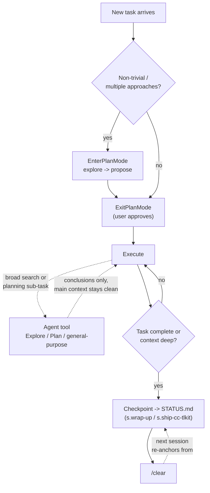

# Session Lifecycle

How a single Claude Code session is meant to shape itself: when to plan before acting, when
to delegate instead of doing the work in the main thread, and when to stop and hand off to
the next session. Three mechanisms, one underlying idea — keep the main thread's context and
commitments narrow, and make handoffs explicit rather than remembered.

## Plan mode — separating "decide" from "do"

`EnterPlanMode` switches the session into a research-and-propose mode before any code is
written; `ExitPlanMode` signals the plan is finished and asks the user to approve it.

- **When to enter:** non-trivial implementation — new features, multi-file changes, anything
  with more than one reasonable approach, or unclear requirements that need codebase
  exploration first. Skip it for single-line fixes or when the user already gave precise,
  detailed instructions.
- **Inside plan mode:** explore with `Glob`/`Grep`/`Read`, use `AskUserQuestion` to resolve
  open approach questions — but never to ask "is this plan okay?", since that question *is*
  what `ExitPlanMode` asks on the user's behalf.
- **`ExitPlanMode` doesn't take the plan as a parameter.** The plan is written to a plan file
  first; the tool just signals "done planning, ready for review" and the user sees the file's
  contents.
- This mirrors the operator's own global-`CLAUDE.md` rule almost exactly: diagnose → propose
  (what/where/why) → wait for explicit go-ahead. Plan mode is the tool-level enforcement of
  that same shape for larger tasks; smaller ones still follow the rule by prose discipline
  alone, without invoking the tool.

## Subagent delegation — keeping the main thread's context clean

The `Agent` tool dispatches a task to a fresh, isolated agent with no memory of the current
conversation — it must be briefed like a colleague who just walked in. Available types in
this environment:

| Type | Tools | Use for |
|---|---|---|
| `Explore` | Read-only (no Edit/Write/Agent) | Broad fan-out search across many files/dirs when only the conclusion matters, not the raw dumps |
| `Plan` | Read-only (no Edit/Write/Agent) | Designing an implementation strategy — step-by-step plans, critical files, tradeoffs |
| `general-purpose` | All tools | Multi-step tasks that need to research *and* act |
| `claude-code-guide` | Read-only + web | Questions about Claude Code, the Agent SDK, the Claude API, or Claude Tag |
| `claude` | All tools | Catch-all default |
| `statusline-setup` | `Read`, `Edit` | Configuring the statusline setting specifically |

The `Explore`/`Plan` split matters: both are read-only and return conclusions, not file
dumps, so a broad sweep doesn't bloat the main session's context — but `Explore` is for
"where is X / what does the codebase do" and `Plan` is for "given what's there, how should
this be built." Reserve `general-purpose` (or a direct tool call) for anything that has to
write code — a research agent cannot also be the one implementing its own findings without
losing the isolation benefit.

Agents run in the **background** by default (the caller is notified on completion and should
not poll); pass `run_in_background: false` only when the result is needed before the turn can
continue. Never race a backgrounded agent — its findings don't exist in the conversation
until its completion notification actually arrives.

## The one-task-per-session → checkpoint → `/clear` cadence

Global `CLAUDE.md`'s `## Session lifecycle` rule: **one task per session.** When a task
completes, or context is running deep, say so and checkpoint before starting unrelated work,
rather than letting one session span multiple unrelated tasks.

- **Checkpoint** means writing the current state somewhere durable *before* clearing — in
  this toolkit, that's `STATUS.md` (see [[memory-architecture]]'s working-memory tier), most
  often produced by `s.wrap-up` or `s.ship-cc-tlkit` (see [[skills-catalog]]).
- **`/clear`** then resets the conversation. Nothing is lost because the checkpoint already
  captured "where things stand."
- **On resume**, re-anchor from the checkpoint note instead of asking the user to re-explain
  where things left off — `STATUS.md`'s `## Where we are` / `## Next step` sections exist
  specifically to make that re-anchor a read, not a conversation.

This is a discipline enforced by convention and by the skills that write `STATUS.md`, not by
a harness mechanism — nothing stops a session from running long except the operator (or
Claude) choosing to checkpoint and clear.

## How the three fit together

## Related
- [[memory-architecture]] — `STATUS.md` is the checkpoint target this cadence writes to
- [[skills-catalog]] — `s.wrap-up` and `s.ship-cc-tlkit` are what actually write the checkpoint
- [[hooks-and-permissions]] — the settings/hook surface a session runs under
- [[harness-overview]] — anchor note for this zone
