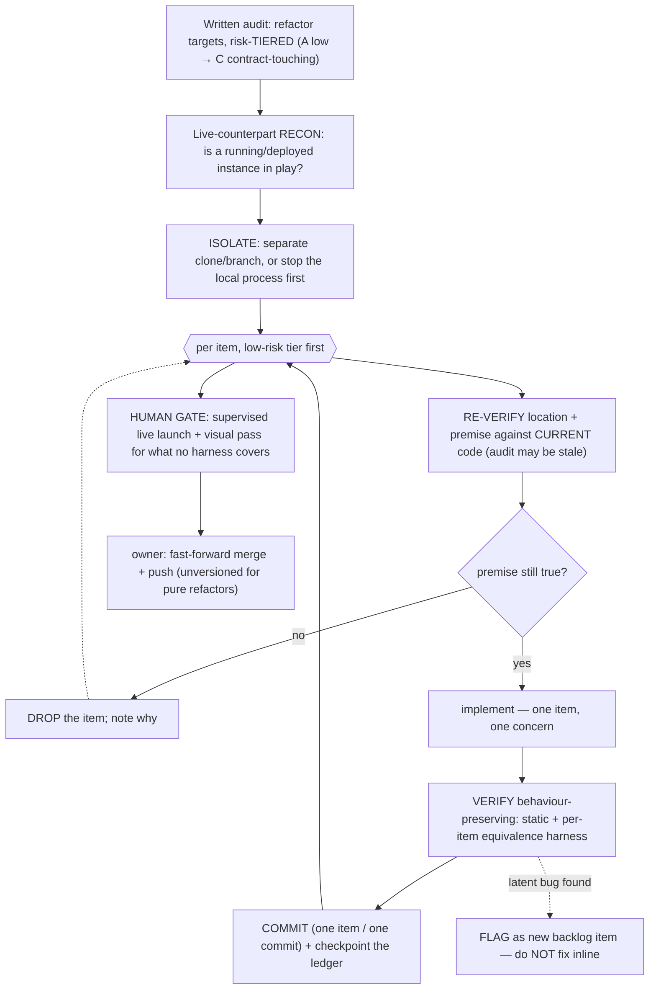

# Behaviour-Preserving Refactor Workflow

How to take a backlog of refactor targets and land them safely against a system that
may be **running in production while you work** — without changing a single observable
behaviour. Distilled from a three-tier engine refactor executed as autonomous goal runs.

One-line mental model: **a refactor is a bet that output is unchanged; the workflow's
whole job is to make that bet cheap to prove and impossible to lose silently.**

The execution loop below is automated by the `s.goal-run` skill
(`cc-toolkit/skills/s.goal-run/`); this playbook is the *why* and the invariants behind it.

## Flowchart

## Runbook — Start from a written, tiered audit

Never refactor from vibes. The input is an **inventory**: each target is one item with a
location, a stated defect (duplication, a god-method, positional-arg soup, a per-cycle
recompute), and a **risk tier**:

- **Tier A — mechanical / local.** Dedup verbatim blocks into a helper; `lru_cache` a pure
  hot function; name anonymous formatter closures. Blast radius ≈ zero.
- **Tier B — shared intermediates / control-flow.** Compute-once-per-cycle context shared by
  two consumers; convert positional signatures to options-objects; extract inline row/card
  factories.
- **Tier C — contract-touching splits.** Break the single largest methods (the ones that
  produce the serialized output contract, or the primary console render) into an orchestrator
  + named sub-builders. Highest risk: a silent field drift ships to every consumer.

Ship tiers **low-risk-first**. Each clean tier buys confidence (and a proven harness pattern)
for the next. Contract-touching splits go last, behind the heaviest verification.

## Runbook — Recon the live counterpart BEFORE touching anything

The first move is not code — it's asking *"what does a running or deployed copy of this system
make unsafe to test?"* A live process may hold an exclusive resource (a device/COM subscriber,
a port, a single-writer file, a market data feed) that a second instance would collide with.
Resolve it up front:

- run from an **isolated clone** while production runs from its own folder, **or**
- **stop the local process first** and launch only under supervision.

This recon is the opening step of the `s.goal-run` skill for exactly this reason.

## Runbook — Re-verify every item against current code (audits go stale)

An audit written months ago points at line numbers and premises that have since moved. Before
editing **any** item, re-investigate it against the code as it is now:

- Line numbers drift — re-locate by structure, not by the audit's coordinates.
- **Premises expire.** In the origin run, one item's target (a 219-line god-function) had
  already been split months earlier by an unrelated change; the correct action was to **drop
  the item**, not manufacture work to match the stale note. Freshly re-investigate; trust the
  code, not the audit.

## Runbook — The per-item loop (locate → implement → verify → commit → checkpoint)

One item at a time, **one commit per item**, on a dedicated branch. After each item, update a
durable **ledger** (the audit page itself, or a backlog file) so a resumed session — or a
crashed autonomous run — knows exactly what shipped and what's left. Keep each commit to a
single concern; the review unit for a whole tier is then a readable stack of one-idea commits.

## Runbook — Verify behaviour-preserving (the core discipline)

The contract is: **observable output is byte-identical.** Prove it per item, scaled to blast
radius:

- **Always:** static checks — compile/AST for the backend, `node --check` (or equivalent) on
  every extracted front-end fragment. Ref-count that nothing dangles.
- **Anything touching live control flow or the output contract:** a **behavioural-equivalence
  harness** — run old vs new across a scenario matrix (both actor paths, every mode flag,
  every currency/locale, and degraded/empty inputs) and assert output **byte-identical modulo
  volatile fields** (timestamps normalized out). In the origin run this caught nothing *because*
  it was written first — that is the point; it licenses the merge.
- **Mutation-test the harness itself** on the highest-risk items: deliberately break the new
  code and confirm the harness goes red. A green harness only means something if you've seen
  it fail.

## Runbook — The human gate for what no harness covers

Some surfaces have no automated oracle — a visual dashboard, a rendered panel, an interaction
toggle. For those, the gate is a **supervised live launch + manual toggle-cycle by the owner**
*before* merge authorization. Name this explicitly as the one verification a harness cannot
substitute; don't let a green static check masquerade as coverage it doesn't have.

> Watch for confounders at launch. A slow startup in the origin run looked like a refactor
> regression but root-caused to a **missing `.venv`** in the fresh clone (cold system
> interpreter) — environment, not code. Rule out the environment before blaming the diff.

## Runbook — Merge / push / version boundaries

- **Fast-forward merge** when the trunk hasn't diverged; otherwise the branch stack stays a
  clean review unit.
- **Ship pure refactors UNVERSIONED.** Behaviour is unchanged by definition, so a version bump
  would over-signal. (Feature work earns a version; a refactor does not.)
- **Hard boundary: the workflow never merges, pushes, or deletes on its own.** Autonomous
  execution stops at a clean, committed branch; a human authorizes the merge and the push. This
  is a defining guardrail of `s.goal-run`, not a nicety.

## Runbook — Handle what you find mid-flight

Refactoring reads code closely, so it surfaces unrelated defects. Discipline:

- **Latent bug found → flag it as a new backlog item, do not fix it inline.** A behaviour-fix
  inside a behaviour-preserving refactor pollutes the "output unchanged" guarantee and the
  equivalence harness. In the origin run, two diverged null-checks and a latent `ReferenceError`
  were logged for a follow-up pass, not touched.
- **Dead code found → note it, don't gold-plate.** Record it; leave removal to a scoped cleanup.
- **Premise vanished → drop the item** (see re-verify above).

## Key invariants (don't violate)

- **Behaviour-preserving means byte-identical observable output.** If you can't assert that,
  you're not refactoring — you're changing behaviour, and it needs a different gate.
- **Recon the live counterpart before the first edit.** A colliding second instance is the
  failure that isolation exists to prevent.
- **Re-verify against current code; never trust a stale audit's coordinates or premises.**
- **One item, one commit, ledger updated** — so any run is resumable and any tier is reviewable.
- **The workflow stops at a committed branch.** Merge/push/delete are human decisions, always.
- **Fixes and refactors don't mix in one commit.** Latent bugs found mid-refactor are flagged,
  not folded in.

## Transfer note

The pattern generalizes to any behaviour-preserving change against a system with a real output
contract and a live counterpart: a **tiered inventory** so risk is sequenced not stumbled into;
**recon-then-isolate** so a running instance never collides with your test; a **per-item loop
with an equivalence oracle** proven by mutation to actually fail; a **named human gate** for the
un-harnessable surface; and **hard human boundaries on merge/push** so autonomy never ships
unreviewed. Swap "engine method" for schema migration, API-response refactor, or query rewrite —
the skeleton holds.

## Related
- [[README]] — playbooks folder intent
- [[cc-toolkit-deploy-lifecycle]] — sibling repeatable runbook (config-as-code deploy)
- [[prove-empty-diff-before-consolidating]] — sibling I06-origin playbook (safe-consolidation
  discipline vs. this one's safe-splitting discipline)
- [[../harness/skills-catalog]] — where `s.goal-run` (this loop, automated) is cataloged
- [[../wiki-schema]] — brain conventions, promote/query/lint flows
