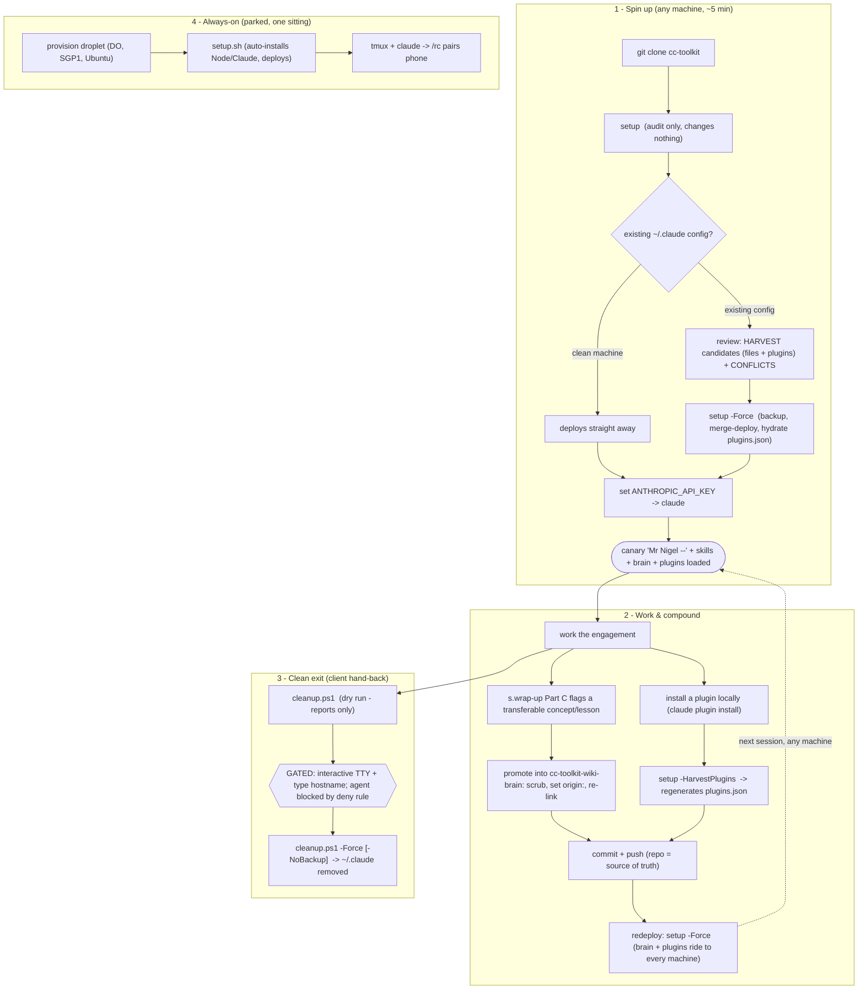

# cc-toolkit Deploy Lifecycle

The end-to-end runbook for the toolkit itself: how to stand it up on any machine, work,
grow the brain, and hand a machine back clean. **Fetch this before running setup** — it is
the canonical flow, so you never have to re-infer the steps.

One-line mental model: **GitHub is the source of truth; every machine deploys *from* it,
never the other way round.** Curate in the repo clone → commit → push → deploy.

## Flowchart



## Runbook — Spin up (Windows-first)

```powershell
# 1. Clone the source of truth
git clone https://github.com/NigelGKT/cc-toolkit.git
cd cc-toolkit

# 2. AUDIT (read-only). On an existing config it prints CONFLICTS / HARVEST / WOULD-ADD
#    and changes nothing. On a clean machine it just deploys.
.\deployment\windows\setup.ps1

# 3. HARVEST first (only if the audit lists HARVEST CANDIDATES): copy anything machine-only
#    UP into the repo, commit, push. Skipping this loses that machine's customizations.

# 4. DEPLOY. Backs up existing toolkit files to ~/.claude.backup-<ts>, then merges
#    (never mirror-deletes; never touches secrets or settings.local.json).
.\deployment\windows\setup.ps1 -Force

# 5. Key + launch
$env:ANTHROPIC_API_KEY = "sk-ant-..."   # from password manager
claude                                   # confirm the "Mr Nigel --" canary
```

Unix / VPS is identical in spirit: `bash deployment/unix/setup.sh` (auto-installs Node via
nvm + Claude via npm), `--force` to deploy.

## Runbook — Grow the brain (the compounding loop)

1. At session end, `s.wrap-up` **Part C** flags a generalizable concept or lesson.
2. Copy it from the project wiki into `cc-toolkit-wiki-brain/` (`concepts/` for a pattern,
   `playbooks/` for a checklist). **Scrub** all client identifiers from the body; record the
   source only in `origin:`. Re-link `[[...]]` and update `index.md`.
3. `git commit && git push` in the repo clone.
4. Redeploy (`setup -Force`) so the new knowledge rides to every machine.

Query the other direction before solving anything cold: *"what does my brain say about X"* →
`s.wiki` against `~/.claude/cc-toolkit-wiki-brain/`.

## Runbook — Harvest local files (general, any toolkit item)

The inverse of deploy, for **files** (`plugins.json` harvest is separate — see below). Lists
toolkit files that exist on this machine but not in the repo (NEW-UP), or that were edited
here and are newer than the repo copy (CHANGED-UP), so you can pull local work UP before it's
lost to the next deploy.

```powershell
.\deployment\windows\setup.ps1 -Harvest          # dry run - lists candidates, copies nothing
.\deployment\windows\setup.ps1 -Harvest -Force   # copies NEW-UP + CHANGED-UP into the repo tree
```

Classification is **content-hash authoritative** (a real byte/semantic diff), with mtime used
only as a direction *hint* — a fresh `git clone` resets mtimes, so right after cloning treat
"REPO NEWER" results with care rather than trusting the hint blindly. Files where the repo is
newer are **skipped**, not harvested (that direction is a deploy, not a harvest). Secrets
(`.credentials.json`, `settings.local.json`) are never harvested regardless.

`settings.json` gets special handling: rather than a raw byte diff, it's compared after
stripping the runtime keys plugin hydration writes (`enabledPlugins`,
`extraKnownMarketplaces`) and canonicalizing key order — so a deploy's own side-effects never
register as drift needing harvest.

**Always run the dry run first and read the candidate list before `-Force`** — harvest has no
per-file filter; it sweeps up everything classified as a candidate in one pass, including
unrelated local drift that happens to exist alongside the change you meant to harvest.

## Runbook — Drift-check hook (SessionStart)

`drift-check.ps1` wraps `setup.ps1 -Check` and is wired as the `SessionStart` hook in
`settings.json`, so it runs once per session launch. It is silent and side-effect-free by
design — no installs, no deploy, just a verdict:

- Throttled to once per 24h via a marker file (`~/.claude/.toolkit-drift-check`), so it adds
  no latency to repeated launches the same day.
- Prints **one line** only if local toolkit files exist that aren't yet harvested (e.g.
  `cc-toolkit: 1 local file(s) not yet harvested -> run: setup.ps1 -Harvest`); prints nothing
  otherwise.
- Wrapped in try/catch — a hook must never break session start, so any error is swallowed.

This is the **only** standing guard against local edits being silently destroyed by the next
`-Force` deploy — see the amended invariant below.

## Runbook — Harvest a plugin (install local, ride everywhere)

Plugins are the one item that is **hydrated, not copied**. `~/.claude/plugins/` is runtime
state (self-updating, absolute machine paths) and stays gitignored — so we version the
*intent* in `plugins.json` and re-install on deploy.

```powershell
# 1. Install locally however you like
claude plugin marketplace add kepano/obsidian-skills
claude plugin install obsidian@obsidian-skills

# 2. Pull the intent UP into the manifest (strips machine-specific paths/timestamps)
.\deployment\windows\setup.ps1 -HarvestPlugins    # regenerates plugins.json

# 3. Commit + push
git add plugins.json; git commit -m "harvest: obsidian-skills"; git push

# 4. On any machine, the next deploy re-installs it automatically
.\deployment\windows\setup.ps1 -Force             # marketplace add + install (idempotent)
```

The audit (`setup.ps1` on an existing config) lists installed-but-unrecorded plugins as
**HARVEST CANDIDATES (plugins)** and manifest-but-not-installed ones as **WOULD BE
INSTALLED** — the same intent comparison, never a byte diff.

## Runbook — Session close-out (work → harvest → wrap-up → harvest → commit)

The canonical order for a cc-toolkit session. The sequence is **not** arbitrary — it is a
read-before / write-after sandwich around `s.wrap-up`:

1. **Work** in `~/.claude` (skills, settings, brain notes, contract).
2. **Harvest #1** — `setup.ps1 -Harvest` (dry run) → review the list → `-Harvest -Force`.
   This is what makes the work **visible to git**: `~/.claude` is not a repo, so until you
   harvest, `git status` in the clone shows nothing.
3. **Wrap-up** — `/s.wrap-up`. Its git orientation now works (step 2 populated the diff). It
   writes the session note into `~/.claude/cc-toolkit-wiki-brain/syntheses/` — the **authoring**
   copy, per the curate-locally-then-harvest rule.
4. **Harvest #2** — syncs the session note + `index.md`/`log.md` up. One command, a few files.
5. **Commit + push** from the repo clone. Session notes conventionally get their **own** commit
   (`wiki:` / `brain:` prefix), separate from the feature commit — one note may cover several
   versions.
6. **Refresh `STATUS.md` — after the push, not before.** Record the released version + commit
   SHAs and drop the "pending commit" line. Small `chore:` commit. **This step is not optional
   bookkeeping — it is the only thing that makes STATUS.md true.**

**Why step 6 exists (the stale-STATUS trap):** wrap-up writes `STATUS.md` at step 3, but the
commit doesn't exist until step 5. So at the moment of push, STATUS.md *always* claims the work
is "not yet committed" — describing a world one step behind reality. Since STATUS.md is the
designated re-anchor point for the next session, a stale one actively misleads: it sends you to
redo work that already shipped. This has bitten twice — the v1.14.0 entry claimed uncommitted
work that was already pushed, and the same drift recurred on 2026-07-16. STATUS.md is repo-local
(not on the deploy manifest), so edit it in the clone directly; no harvest needed.

**Why two harvests (not redundancy):** every phase that *authors into* `~/.claude` ends with a
harvest. The work is phase one; the session note is phase two. The harvest between them exists
because wrap-up must **read** the work through `git diff`, and git only ever sees the repo. To
collapse to one harvest you must break a constraint: either wrap-up enumerates from memory
instead of the diff (the failure mode that loses session notes), or the note is authored into
the repo copy and `~/.claude` — the copy `s.wiki` actually queries — goes stale until the next
deploy down.

**The staging trap:** harvest has **no per-file filter** — it sweeps every candidate in one pass.
Unrelated local drift rides along into the working tree (a stray `effortLevel`, whatever `/model`
last persisted to `settings.json`). **Stage by name at step 5; never `git add -A`.**

**Split-root wrap-up:** the git repo (`cc-toolkit`) and the authoring copy (`~/.claude`) are
different roots. Wrap-up reads git from the former and writes the note to the latter — resolve
both independently; neither one root serves both jobs.

## Runbook — Clean exit (client hand-back)

```powershell
.\deployment\windows\cleanup.ps1                  # dry run - shows what WOULD be removed
.\deployment\windows\cleanup.ps1 -Force           # backs up to ~/.claude.backup-cleanup-<ts>, then removes
.\deployment\windows\cleanup.ps1 -Force -NoBackup # client exit - no residue left behind
```

`-Force` is gated twice so it cannot fire by accident: an assistant is blocked at the tool
boundary (`permissions.deny` in `settings.json`), and the script itself refuses a
non-interactive shell and demands you type the machine's hostname to confirm.

## Why -Force is safe (not destructive) in setup

`setup.ps1 -Force` is a **confirmation gate past the audit stop**, not a wipe. It takes a
timestamped backup first, then *merges* toolkit files in (`Copy-Item -Recurse -Force`) — it
never mirror-deletes and never touches secrets (`.credentials.json`, `settings.local.json`)
or runtime state. Contrast `cleanup.ps1 -Force`, which **is** destructive (removes all of
`~/.claude`) — hence its extra human gate.

## Key invariants (don't violate)

- **Prefer curating in the repo clone.** Local editing of the deployed
  `~/.claude/cc-toolkit-wiki-brain/` is supported via `-Harvest` — **harvest promptly**: an
  unharvested local edit is destroyed by the next `-Force` deploy (a merge-copy, not a diff-aware
  one), and the drift-check hook above is the only standing guard against that. *(Amended
  2026-07-16 — this invariant originally read "never edit the deployed copy," written before
  the `-Harvest` flow existed. It was over-strict, not wrong: the real risk was always losing
  an edit to the next deploy, and `-Harvest` now gives that edit a way out.)*
- **Secrets never enter the repo** — API key from a password manager; `.credentials.json`
  and `settings.local.json` stay local (the latter is where machine-specific hooks live and
  survives deploys untouched).
- **Deploy contract is folder-name-keyed** — `ToolkitItems = CLAUDE.md, settings.json,
  skills, cc-toolkit-wiki-brain`. Renaming a deployed folder means updating that list in
  `setup.ps1` **and** `setup.sh` in lockstep, or it silently stops deploying.
- **Plugins are hydrated, never copied** — `plugins.json` (marketplaces + plugin names) is
  the source of truth; the `~/.claude/plugins/` folder is gitignored runtime state. Never
  commit the folder; harvest with `-HarvestPlugins` (PowerShell) / `--harvest-plugins`
  (bash), which strips machine-specific paths. Windows and Unix are at parity as of v1.10.

## Transfer note

The pattern generalizes to any "config-as-code deployed to disposable machines" setup:
audit-before-write with a harvest step so a target's local drift is pulled up before it's
overwritten; a merge (never mirror) deploy that leaves secrets and local overrides alone;
and a separate, human-gated teardown path kept well away from the everyday deploy path.

## Related
- [[../wiki-schema]] — brain conventions, promote/query/lint flows
- [[README]] — playbooks folder intent
- [[../harness/harness-overview]] — where this playbook sits in the overall tooling map
- [[../harness/memory-architecture]] — how this brain (deployed by the lifecycle above) fits
  the broader memory/knowledge routing picture
